# 🚗 Multilingual RAG Demo - Car Troubleshooting System

## 📖 Introduction

Welcome to the **Multilingual RAG Demo** repository! This project provides a comprehensive exploration of building Retrieval-Augmented Generation (RAG) systems that handle **multilingual content** effectively. Through a practical car troubleshooting use case, we demonstrate various strategies for indexing, searching, and retrieving information across **7 different languages** (English 🇬🇧, French 🇫🇷, Spanish 🇪🇸, Japanese 🇯🇵, Chinese 🇨🇳, Greek 🇬🇷, and Hebrew 🇮🇱).

### 🎯 What This Project Demonstrates

This repository contains a complete end-to-end implementation showing:

1. **Data Generation**: Creating realistic multilingual datasets that simulate real-world scenarios
2. **Index Strategies**: Three different approaches to handling multilingual content in Azure AI Search
3. **Vector Embeddings**: Comparing multiple embedding models (Cohere vs. OpenAI) and approaches (native vs. translated)
4. **Search & Retrieval**: Implementing semantic search across multiple languages
5. **Production API**: FastAPI-based search service for AI agents and applications
6. **Agent Integration**: Building AI agents that can understand and respond in multiple languages

### 🏗️ System Architecture

```mermaid
graph TB
    A[📝 Data Generation] --> B[🔍 Index Creation]
    B --> C{Indexing Strategy}
    
    C -->|Strategy 1| D[🌐 Multilanguage<br/>Native Vectors<br/>Cohere 1024-dim]
    C -->|Strategy 2| E[🔄 Translated<br/>English Vectors<br/>OpenAI 1536-dim]
    C -->|Strategy 3| F[🌐 Multilanguage<br/>Native Vectors<br/>OpenAI 1536-dim]
    
    D --> G[📊 Document Indexing]
    E --> G
    F --> G
    
    G --> H[🔍 Vector Search]
    H --> I[🔌 Search API]
    I --> J[🤖 AI Agent/Copilot]
    J --> K[💬 Multilingual Responses]
    
    style A fill:#4A90E2,stroke:#2E5C8A,stroke-width:2px,color:#fff
    style D fill:#27AE60,stroke:#1E8449,stroke-width:2px,color:#fff
    style E fill:#E74C3C,stroke:#C0392B,stroke-width:2px,color:#fff
    style F fill:#9B59B6,stroke:#7D3C98,stroke-width:2px,color:#fff
    style I fill:#3498DB,stroke:#2874A6,stroke-width:2px,color:#fff
    style K fill:#F39C12,stroke:#D68910,stroke-width:2px,color:#fff
```



### 🌍 The Challenges of Multilingual RAG Systems

Building effective multilingual RAG systems presents several unique challenges that this project addresses:

#### 1. **Embedding Model Language Support** 🧠

**Challenge**: Not all embedding models support all languages equally well. Models trained primarily on English data often show degraded performance on non-English content, especially for languages with non-Latin scripts (e.g., Japanese, Chinese, Hebrew).

**Impact**:
- Semantic similarity calculations may be less accurate for non-English content
- Retrieval quality varies significantly across different languages
- Some languages may not be supported at all by certain embedding models

**Example**: A query in Hungarian might not find relevant documents effectively if the embedding model wasn't trained on sufficient Hungarian text.

#### 2. **Cross-Language Information Retrieval (CLIR)** 🔄

**Challenge**: Users may query in one language while the most relevant documents exist in another language.

**Scenarios**:
- User queries in French, but the best answer is in an English document
- Technical documentation exists in English, but users speak multiple languages
- Brand names and technical terms may be in English even in non-English documents

#### 3. **Translation Quality vs. Cost Trade-offs** ⚖️

**Challenge**: Translation introduces additional complexity, latency, and cost while potentially degrading quality.

**Considerations**:
- **Batch translation** (documents): Cost-effective for static content, allows human review
- **Real-time translation** (queries): Necessary for dynamic content, higher cost per query
- **Translation errors**: Can compound with retrieval errors, reducing overall system quality
- **Context loss**: Technical terminology and nuances may be lost in translation

#### 4. **Language Consistency** ✅

**Challenge**: Ensuring the system responds in the same language as the user's query.

**Problems**:
- LLMs may "hallucinate" responses in unexpected languages
- Mixed-language documents can confuse language detection
- Users expect responses in their query language, but the system might default to English

#### 5. **Evaluation Complexity** 📊

**Challenge**: Benchmarking and evaluation datasets are primarily available in English.

**Issues**:
- Limited multilingual evaluation datasets exist
- Performance metrics must be calculated separately for each language
- Translation quality needs separate evaluation from retrieval quality
- No single metric captures end-to-end multilingual performance

### 💡 Solution Strategies Implemented in This Project

This repository demonstrates three main approaches to handle these challenges:

#### Strategy 1️⃣: Native Language Embeddings with Cohere (Multilanguage Index)

**Approach**: Use Cohere's specialized multilingual embedding model (embed-v3-multilingual) that can embed text in 100+ languages into the same vector space.

**Pros**:
- ✅ No translation needed - preserves original meaning and nuances
- ✅ Lower latency - one less processing step
- ✅ Potentially better semantic understanding in native language
- ✅ Cost-effective for query-heavy workloads

**Cons**:
- ❌ Embedding model must support all languages well
- ❌ Performance varies significantly across languages
- ❌ Difficult to evaluate quality for all languages

**Best for**: When you have a high-quality multilingual embedding model and documents primarily in supported languages.

#### Strategy 2️⃣: Translate to English (Translated Index)

**Approach**: Translate all documents to English during indexing, then use high-quality English embedding models (like OpenAI).

**Pros**:
- ✅ Leverage powerful English-trained models
- ✅ Consistent quality across all languages (English quality)
- ✅ Better evaluation tools and benchmarks available
- ✅ Easier to debug and validate

**Cons**:
- ❌ Translation cost and time during indexing
- ❌ Potential loss of nuance and context
- ❌ Must translate queries in real-time if not in English
- ❌ Technical terms may be mistranslated

**Best for**: Static document collections that can be batch-translated, especially when English embedding models significantly outperform multilingual alternatives.

#### Strategy 3️⃣: Native Language Embeddings with OpenAI (Multi Language OpenAI Index)

**Approach**: Use OpenAI's text-embedding-3-large model which has built-in multilingual capabilities to embed documents in their original language. This model supports **100+ languages** with general-purpose multilingual support.

**Pros**:
- ✅ No translation needed - preserves original meaning
- ✅ Single model for both indexing and search queries
- ✅ High-quality embeddings (1536 dimensions)
- ✅ Simpler pipeline than translation-based approach
- ✅ Good performance on major languages
- ✅ Supports 100+ languages with varying levels of proficiency

**Cons**:
- ❌ Variable accuracy across different languages
- ❌ Best for well-represented languages in training data
- ❌ Not specifically designed for multilingual scenarios like Cohere's model

**Best for**: Applications requiring high-quality embeddings for major languages with a simple implementation, where you want to use OpenAI for both embeddings and LLM responses.

### 📊 Strategy Comparison

| Feature | Cohere Native | OpenAI Translated | OpenAI Native |
|---------|---------------|-------------------|---------------|
| **Dimensions** | 1024 | 1536 | 1536 |
| **Translation Required** | ❌ No | ✅ Yes | ❌ No |
| **Language Support** | 100+ (multilingual-optimized) | English only | 100+ (general-purpose) |
| **Setup Complexity** | Medium | High | Low |
| **Best For** | Multilingual-specific optimization | Consistent English quality | Simplified multilingual |
| **Index Name** | `multilanguage` | `translated` | `multi_language_openai` |

---

## 🌟 Deep Dive: Cohere Embeddings for Multilingual RAG

Strategy 1 (Native Language) leverages **Cohere's embed-v3-multilingual** model, a specialized multilingual embedding solution specifically designed for cross-language scenarios. It supports **over 100 languages** including Korean, Japanese, Arabic, Chinese, Spanish, French, and many more. Understanding how Cohere embeddings work is crucial for building effective multilingual RAG systems.

### 🔑 The Power of `input_type` Parameter

Cohere embeddings are optimized for different use cases through the `input_type` parameter. This is a critical feature that significantly improves retrieval quality by creating embeddings specifically tuned for their intended purpose.

#### Input Types Explained

```mermaid
graph TB
    A[Cohere Embeddings] --> B{input_type}
    
    B -->|Documents| C[search_document]
    B -->|Queries| D[search_query]
    B -->|Training Data| E[classification]
    B -->|Grouping| F[clustering]
    
    C --> G[📄 Optimized for<br/>being searched]
    D --> H[🔍 Optimized for<br/>searching]
    E --> I[🎯 Optimized for<br/>categorization]
    F --> J[📊 Optimized for<br/>similarity grouping]
    
    style A fill:#9B59B6,stroke:#7D3C98,stroke-width:3px,color:#fff
    style C fill:#27AE60,stroke:#1E8449,stroke-width:2px,color:#fff
    style D fill:#E74C3C,stroke:#C0392B,stroke-width:2px,color:#fff
    style E fill:#F39C12,stroke:#D68910,stroke-width:2px,color:#fff
    style F fill:#3498DB,stroke:#2874A6,stroke-width:2px,color:#fff
```



| Input Type | When to Use | Example |
|------------|-------------|---------|
| **`search_document`** | When embedding documents/passages that will be searched | Car troubleshooting articles in the knowledge base |
| **`search_query`** | When embedding search queries from users | User's question: "Why is my engine overheating?" |
| **`classification`** | When embedding text for categorization tasks | Training data for classifying car issues by severity |
| **`clustering`** | When embedding text for grouping similar items | Grouping similar customer complaints together |

#### Why This Matters for RAG Systems

Using the correct `input_type` creates embeddings that are **asymmetrically optimized**:


**Key Insight**: Using `search_document` for indexing and `search_query` for queries creates embeddings that are specifically tuned to work together, improving retrieval accuracy by **15-30%** compared to using generic embeddings.

### 🌍 Multilingual Support Architecture

Cohere's embed-v3-multilingual uses a unified vector space for all 100+ languages, meaning semantically similar content in different languages will have similar embeddings:

```mermaid
graph TB
    A[Cohere embed-v3-multilingual<br/>Multilingual Vector Space] --> B[English: 'Engine overheating']
    A --> C[French: 'Surchauffe du moteur']
    A --> D[Spanish: 'Sobrecalentamiento del motor']
    A --> E[Japanese: 'エンジンの過熱']
    A --> F[Chinese: '发动机过热']
    
    B -.Similar Vectors.-> C
    B -.Similar Vectors.-> D
    B -.Similar Vectors.-> E
    B -.Similar Vectors.-> F
    C -.Similar Vectors.-> D
    C -.Similar Vectors.-> E
    
    style A fill:#9B59B6,stroke:#7D3C98,stroke-width:3px,color:#fff
    style B fill:#27AE60,stroke:#1E8449,stroke-width:2px,color:#fff
    style C fill:#3498DB,stroke:#2874A6,stroke-width:2px,color:#fff
    style D fill:#E67E22,stroke:#CA6F1E,stroke-width:2px,color:#fff
    style E fill:#E74C3C,stroke:#C0392B,stroke-width:2px,color:#fff
    style F fill:#F39C12,stroke:#D68910,stroke-width:2px,color:#fff
```



#### How Cross-Language Retrieval Works


### 🎯 Implementation in This Demo

Here's how we use Cohere embeddings in the multilanguage strategy:

```python
from azure.ai.inference import EmbeddingsClient
from azure.core.credentials import AzureKeyCredential

# Initialize Cohere client (via Azure AI)
cohere_client = EmbeddingsClient(
    endpoint=cohere_endpoint,
    credential=AzureKeyCredential(cohere_key)
)

# 1️⃣ INDEXING: Embed documents with search_document
def embed_document(text: str, language: str):
    """
    Embed a document in any of 100+ supported languages
    """
    response = cohere_client.embed(
        input=[text],
        input_type="search_document",  # ← Optimized for being searched
        model="embed-v3-multilingual",
        embedding_types=["float"],
        output_dimension=1024
    )
    return response.data[0]['embedding']

# 2️⃣ QUERYING: Embed search queries with search_query
def embed_query(query: str):
    """
    Embed a user query - works in any language
    """
    response = cohere_client.embed(
        input=[query],
        input_type="search_query",  # ← Optimized for searching
        model="embed-v3-multilingual",
        embedding_types=["float"],
        output_dimension=1024
    )
    return response.data[0]['embedding']

# Example: Cross-language search
# Document in Japanese
doc_jp = "エンジンが過熱している場合は、冷却液を確認してください"
doc_vector = embed_document(doc_jp, "ja")

# Query in French
query_fr = "Mon moteur chauffe trop, que faire?"
query_vector = embed_query(query_fr)

# These vectors will have high similarity despite different languages!
```

### 📊 Cohere vs. OpenAI: Key Differences

| Feature | Cohere embed-v3-multilingual | OpenAI text-embedding-ada-002 |
|---------|-------------------|-------------------------------|
| **Languages Supported** | 100+ languages (multilingual-optimized) | 100+ languages (general-purpose) |
| **Vector Dimensions** | 1024 (fixed) | 1536 (fixed) |
| **Input Type Optimization** | ✅ Yes (`search_document`, `search_query`) | ❌ No (generic embeddings) |
| **Best Use Case** | Multilingual-specific scenarios | English-only or general multilingual |
| **Multilingual Design** | ⭐⭐⭐⭐⭐ Purpose-built for multilingual | ⭐⭐⭐⭐ Strong general capabilities |

 ### 💡 Best Practices for Using Cohere Embeddings

1. **Always use the correct `input_type`**
   ```python
   # ✅ CORRECT
   doc_embedding = cohere_client.embed(input=[doc], input_type="search_document")
   query_embedding = cohere_client.embed(input=[query], input_type="search_query")
   
   # ❌ WRONG - Don't use same type for both
   doc_embedding = cohere_client.embed(input=[doc], input_type="search_query")
   ```
2. **Language detection is optional**
   - Cohere automatically handles language detection
   - No need to specify language per document
   - The model works across all 100+ languages simultaneously

### 🎯 When to Choose Multi-Language Embeddings vs. Translation

**Choose Multi-Language Embeddings (Native Language)** when:
- ✅ You have truly multilingual content with no dominant language
- ✅ Preserving original text nuances is critical
- ✅ Users query in various languages unpredictably
- ✅ You want to avoid translation costs and latency
- ✅ Your languages are well-supported by your embedding model (Cohere supports [100+ languages](https://docs.cohere.com/docs/embeddings), OpenAI supports 100+ languages)
- ✅ You prefer a simpler pipeline without translation steps

**Choose Translation to English** when:
- ✅ You need consistency and predictability across all languages
- ✅ Your primary language is English with occasional other languages
- ✅ You have static content that can be batch-translated
- ✅ You need extensive debugging and evaluation (English tools are better)
- ✅ You want to leverage the best English-trained embedding models
- ✅ You can afford the translation costs and acceptable latency for your use case

---

### 📚 Expert Guidance & Best Practices

Based on guidance from Microsoft Azure Search and Azure AI teams, here are key recommendations:

#### 🎯 Analyze Your Specific Use Case

> "The best approach is to understand what works best for you by analyzing a representative data sample and quickly building a POC. This helps evaluate both quality and pricing trade-offs."

**Key Questions to Ask**:
1. What languages do your users speak?
2. What languages are your documents in?
3. Is language consistency required (same language in/out)?
4. What is your expected query volume and latency requirements?
5. What is your budget for translation and embedding operations?

#### 🗂️ Design Your Index Structure

Consider creating separate indexes for different strategies:
- **Native language index**: Stores content in original languages with multilingual embeddings
- **Translated index**: Stores English-translated content with English embeddings
- **Language metadata**: Track the original language of each document

This approach ensures:
- ✅ Clear separation of strategies for easy comparison
- ✅ Flexibility to choose the best strategy for your use case
- ✅ Ability to test and benchmark different approaches

#### 🔄 Translation Strategy

**Ask the critical question**: Should answers be returned in the same language as the input, or is any language acceptable?

**If same language is required**:
- Embedding alone won't suffice
- Include translation for both query and response
- Use language detection to identify input language
- Consider using LLM capabilities for translation

**Using LLMs for translation**:
```
A single LLM call can handle:
1. Language detection
2. Query translation
3. Response generation
4. Response translation back to original language
```

This approach may be sufficient for both questions and answers, reducing complexity.

#### 📊 Balance Quality and Cost

Understand your requirements:
- **Expected frequency of calls**: High volume → batch processing more cost-effective
- **Language requirements**: More languages → higher complexity and cost
- **Quality vs. cost trade-off**: Premium models vs. budget constraints
- **Latency requirements**: Real-time vs. batch processing acceptable

---

## ☁️ Azure Resources Required

To run this demo, you need to create the following Azure resources:

### Core Services

- **🔍 Azure AI Search**
  - For indexing and searching multilingual documents

- **🤖 Azure OpenAI Service**
  - For generating embeddings and AI agent responses
  - Models required:
    - `text-embedding-3-large` - For multilingual embeddings (supports 100+ languages)
    - `gpt model` - For AI agent reasoning and response generation

- **🌍 Azure AI Language Service (included in AI Foundry)**
  - For language detection on multilingual documents
  - Used to identify document language before embedding

- **🔄 Azure AI Translator (included in AI Foundry)**
  - For translating documents to English in the translation-based approach
  - Supports batch document translation

- **💾 Azure Storage Account**
  - For temporary storage during document translation
  - Blob containers used for upload/download of translated documents

- **🔐 Cohere API (via Azure AI Foundry or Github Model)**
  - For multilingual embeddings using Cohere's embed-v3-multilingual model
  - Specifically designed for multilingual scenarios with 100+ languages

### Optional Services

- **🐳 Azure Container Registry**
  - For storing the Search API Docker image
  - Required for deploying the containerized API

- **🌐 Azure App Service (Web App for Containers)**
  - For hosting the Search API as a production-ready service
  - Enables integration with AI agents, Copilot Studio, or other applications

---

## 🔌 Search API - Production-Ready Multilingual Search

The `src/search-api` folder contains a **FastAPI-based REST API** that provides production-ready access to the multilingual search functionality. This API can be consumed by:

- 🤖 **AI Agents** - Integrate search as a tool/function
- 💬 **Microsoft Copilot Studio** - Use as a custom connector
- 🌐 **Web Applications** - Direct REST API integration
- 📱 **Mobile Apps** - Cross-platform search access

### 🏗️ API Architecture


### 🎯 API Endpoint

**POST** `/api/car/fix`

**Request Body**:
```json
{
  "brand": "Toyota",
  "model": "Camry",
  "fault": "My battery drains overnight"
}
```

**Response**:
```json
[
  {
    "id": "1",
    "score": 0.89,
    "brand": "Toyota",
    "model": "Camry",
    "fault": "Battery drains when car is parked",
    "fix": "Check for parasitic drain. Common causes include interior lights..."
  }
]
```
### 🐳 Deployment

The API is containerized and ready for production deployment:

**1. Build Docker Image**:
```bash
cd src/search-api
docker build -t car-fix-api:latest .
```

**2. Push to Azure Container Registry**:
```bash
az acr login --name <your-registry-name>
docker tag car-fix-api:latest <your-registry>.azurecr.io/car-fix-api:latest
docker push <your-registry>.azurecr.io/car-fix-api:latest
```

**3. Deploy to Azure App Service (Web App for Containers)**:
- Create a Web App for Containers in Azure Portal
- Configure the container image from Azure Container Registry
- Set environment variables (see `config.py`):
  - `SEARCH_ENDPOINT`
  - `SEARCH_API_KEY`
  - `SEARCH_INDEX_NAME`
  - `OPENAI_ENDPOINT`
  - `OPENAI_KEY`
  - `EMBEDDING_OPENAI_DEPLOYMENT`

**4. Access the API**:
- Swagger UI available at: `https://<your-app>.azurewebsites.net/docs`
- API endpoint: `https://<your-app>.azurewebsites.net/api/car/fix`

---

## 📓 Notebooks Overview

Execute the notebooks in the following order to build a complete multilingual RAG system:

```mermaid
graph LR
    A[1️⃣ Generate Data] --> B[2️⃣ Create Index]
    B --> C[3️⃣ Index Cohere<br/>Multilanguage]
    B --> D[4️⃣ Index OpenAI<br/>Multilanguage]
    B --> E[5️⃣ Index OpenAI<br/>Translated]
    C --> F[6️⃣ Search & Test]
    D --> F
    E --> F
    F --> G[7️⃣ Build Agent]
    
    style A fill:#4A90E2,stroke:#2E5C8A,stroke-width:2px,color:#fff
    style B fill:#F5A623,stroke:#D68910,stroke-width:2px,color:#fff
    style C fill:#27AE60,stroke:#1E8449,stroke-width:2px,color:#fff
    style D fill:#9B59B6,stroke:#7D3C98,stroke-width:2px,color:#fff
    style E fill:#E74C3C,stroke:#C0392B,stroke-width:2px,color:#fff
    style F fill:#50E3C2,stroke:#2ECC71,stroke-width:2px,color:#000
    style G fill:#F39C12,stroke:#D68910,stroke-width:2px,color:#fff
```



### 1️⃣ `generate.data.ipynb` - Dataset Generation

**Purpose**: Creates a realistic multilingual car troubleshooting dataset that simulates real-world multilingual scenarios.

**What it does**:
- 🏭 Generates car problems and solutions across **5 brands** and **10 models**
- ⚠️ Covers **3 common car issues**: engine overheating, brake noise, battery drain
- 🌍 Produces content in **7 languages** with natural variations
- ✍️ Includes intentional grammatical variations to simulate real user input
- 📊 Creates **60 records** total (5 brands × 2 models × 3 problems × 2 variations)
- 💾 Exports data to `car_problems_multilingual.xlsx`

**When to run**: Execute this notebook **first** to generate the test data.

**Output**: `car_problems_multilingual.xlsx` - 60 records with multilingual car problems and solutions

---

### 2️⃣ `create-index.ipynb` - Azure AI Search Index Setup

**Purpose**: Creates three different Azure AI Search indexes to test various multilingual retrieval strategies.

**What it does**:
- 📐 Configures three index schemas with different multilingual approaches:
  - **`multilanguage`**: Native language vectors using Cohere (1024-dim)
  - **`translated`**: English-translated vectors using OpenAI (1536-dim)
  - **`multi_language_openai`**: Native language vectors using OpenAI text-embedding-3-large (1056-dim)
- 🔍 Sets up HNSW vector search for efficient semantic matching
- 🏷️ Configures faceted navigation and filtering capabilities
- 🔧 Defines field mappings and search configurations

**When to run**: Execute this notebook **after generating the data**, before indexing documents.

**Prerequisites**:
- Azure AI Search service
- Environment variables configured in `.env`:
  ```
  SEARCH_ENDPOINT=https://your-service.search.windows.net
  SEARCH_API_KEY=your-admin-api-key
  ```

**Output**: Three search indexes ready for document ingestion and testing

---

### 3️⃣ `indexing_multilanguage_cohere.ipynb` - Cohere Native Language Indexing

**Purpose**: Indexes documents in their original languages using Cohere's multilingual embeddings (Strategy 1).

**What it does**:
- 📖 Reads the multilingual dataset from Excel
- 🌍 Uses Azure AI Language to detect the language of each document
- ✅ Validates that all languages are supported by Cohere (100+ languages)
- 🧮 Generates embeddings using Cohere's embed-v3-multilingual model (1024 dimensions)
- 📤 Uploads documents with native language vectors to Azure AI Search

**When to run**: Execute this **after creating indexes** to populate the `multilanguage` index.

**Key Features**:
- No translation required
- Purpose-built for multilingual scenarios
- Uses `search_document` input type for optimal retrieval
- Designed specifically for cross-language semantic search

**Output**: Populated `multilanguage` index ready for semantic search

---

### 4️⃣ `indexing_multilanguage_openai.ipynb` - OpenAI Native Language Indexing

**Purpose**: Indexes documents in their original languages using OpenAI's text-embedding-3-large model (Strategy 3).

**What it does**:
- 📖 Reads the multilingual dataset from Excel
- 🧮 Generates embeddings using OpenAI text-embedding-3-large (1536 dimensions)
- 📤 Uploads documents with native language vectors to Azure AI Search
- ⚡ Simplified pipeline - no language detection or validation needed

**When to run**: Execute this **after creating indexes** to populate the `multi_language_openai` index.

**Key Features**:
- No translation required
- Same dimensions as translated approach (1536-dim)
- Simpler implementation than Cohere approach
- Good for major languages

**Output**: Populated `multi_language_openai` index ready for semantic search

---

### 5️⃣ `indexing_translate_english.ipynb` - Translation-Based Indexing

**Purpose**: Translates all documents to English before indexing (Strategy 2).

**What it does**:
- 📤 Uploads the multilingual Excel file to Azure Blob Storage
- 🔐 Generates SAS tokens for secure access
- 🔄 Uses Azure Document Translation to translate all content to English
- ⏳ Polls for translation completion
- 📥 Downloads the translated documents
- 🧮 Generates embeddings using Azure OpenAI (1536 dimensions)
- 📤 Uploads documents with English vectors to Azure AI Search

**When to run**: Execute this **after creating indexes** to populate the `translated` index.

**Key Features**:
- Leverages high-quality English embedding models
- Batch translation (cost-effective)
- Consistent quality across all source languages

**Output**: Populated `translated` index with English-only vectors

---

### 6️⃣ `agent.ipynb` - AI Agent Implementation

**Purpose**: Builds intelligent AI agents that handle multilingual car troubleshooting queries using Azure AI Foundry.

**What it does**:
- 🤖 Implements **two different agent strategies**:
  - **English Translation Agent**: Translates all queries to English before search
  - **Native Language Agent**: Searches using the query's original language
- 🔧 Uses Azure AI Foundry Agents with function calling capabilities
- 💬 Demonstrates orchestrated multi-turn conversations
- 🎯 Shows language-aware response generation

**When to run**: Execute this **last** to see end-to-end agent interactions with the search system.

**Key Features**:
- Function calling for dynamic search
- Language detection and routing
- Context-aware responses
- Multi-turn conversation support

**Output**: Fully functional multilingual AI agents

---

## 🚀 Getting Started

### Prerequisites

Before running the notebooks, ensure you have the following:

#### 1. **Azure Services** ☁️

- ✅ Azure AI Search
- ✅ Azure OpenAI Service
- ✅ Azure AI Language (Text Analytics)
- ✅ Azure AI Translator
- ✅ Azure Blob Storage
- ✅ Azure AI Foundry Project (for agents)

#### 2. **Python Environment** 🐍

Required packages:
- `azure-search-documents`
- `azure-ai-textanalytics`
- `azure-ai-translation-text`
- `azure-storage-blob`
- `azure-ai-inference`
- `azure-ai-projects`
- `openai`
- `pandas`
- `python-dotenv`

#### 3. **Environment Variables** 🔑

Create a `.env` file in the `notebook/` directory with:

```env
# Azure AI Search
SEARCH_ENDPOINT=https://your-service.search.windows.net
SEARCH_API_KEY=your-admin-key

# Azure AI Language
LANGUAGE_ENDPOINT=https://your-language.cognitiveservices.azure.com/
LANGUAGE_KEY=your-language-key

# Azure AI Translator
TRANSLATION_ENDPOINT=https://api.cognitive.microsofttranslator.com
TRANSLATION_KEY=your-translator-key
TRANSLATION_REGION=your-region

# Azure Blob Storage
STORAGE_ACCOUNT_NAME=your-storage-account
STORAGE_ACCOUNT_KEY=your-storage-key

# Cohere (via Azure AI)
COHERE_ENDPOINT=https://your-cohere.inference.ai.azure.com
COHERE_KEY=your-cohere-key
COHERE_MODEL=

# Azure OpenAI
AI_FOUNDRY_OPENAI_ENDPOINT=https://your-openai.openai.azure.com/
OPENAI_KEY=your-openai-key
OPEN_AI_CHAT_MODEL=
EMBEDDING_MODEL=

# Azure AI Foundry (for agents)
AI_FOUNDRY_PROJECT_ENDPOINT=
```

### Execution Order

Follow this sequence to build the complete system:

```mermaid
graph TB
    A[📝 1. generate.data.ipynb<br/>Create Dataset] --> B[🏗️ 2. create-index.ipynb<br/>Setup Indexes]
    
    B --> C[🌐 3. indexing_multilanguage.ipynb<br/>Strategy 1]
    B --> D[🔄 4. indexing_translate_english.ipynb<br/>Strategy 2]
    
    C --> E[🤖 5. agent.ipynb<br/>Build AI Agents]
    D --> E
    
    style A fill:#4A90E2,stroke:#2E5C8A,stroke-width:3px,color:#fff
    style B fill:#F5A623,stroke:#D68910,stroke-width:3px,color:#fff
    style C fill:#27AE60,stroke:#1E8449,stroke-width:3px,color:#fff
    style D fill:#E74C3C,stroke:#C0392B,stroke-width:3px,color:#fff
    style E fill:#F39C12,stroke:#D68910,stroke-width:3px,color:#fff
```


---